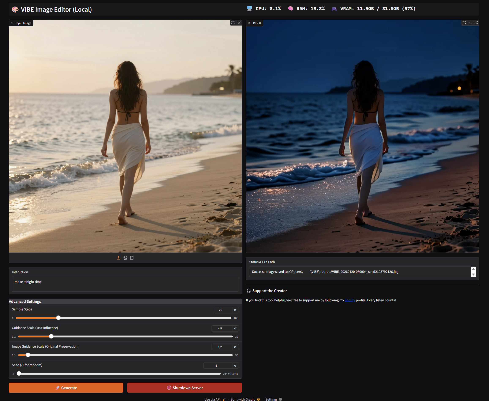
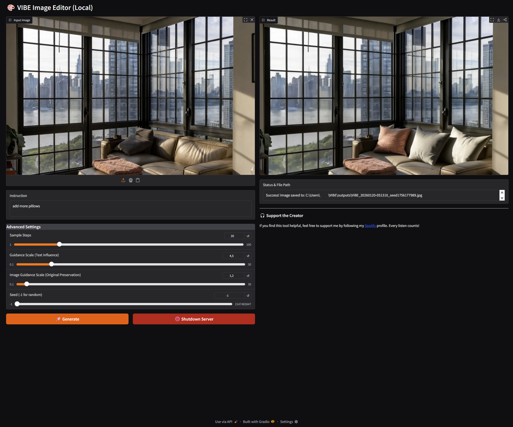
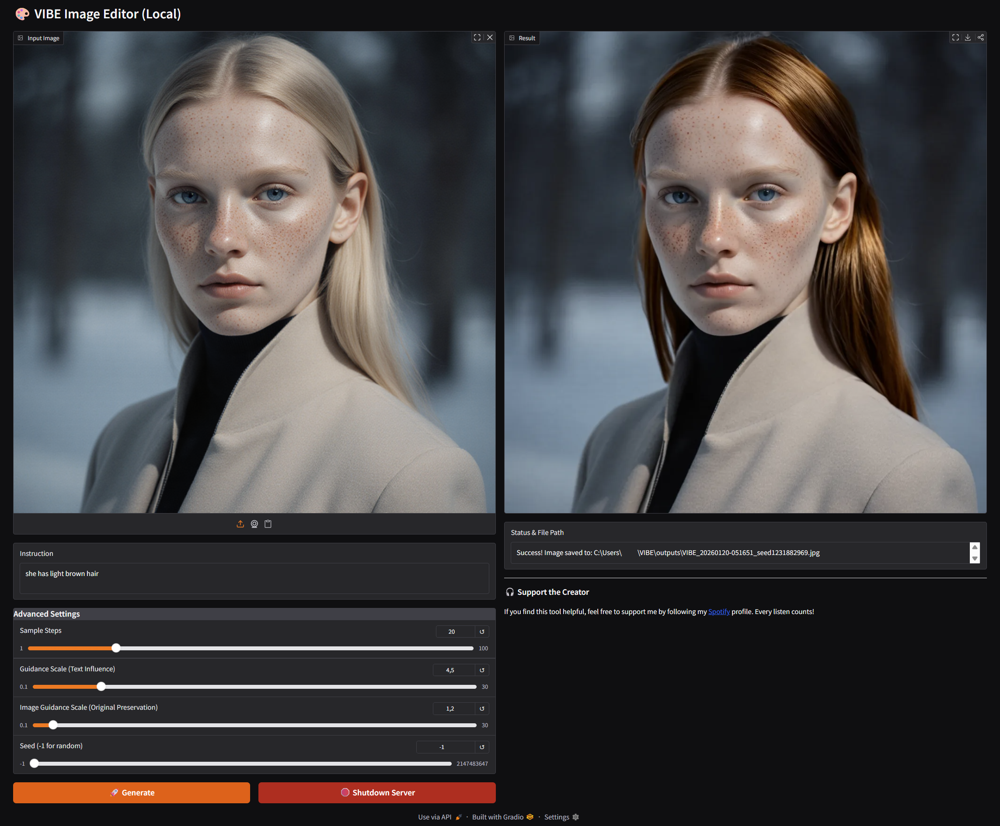
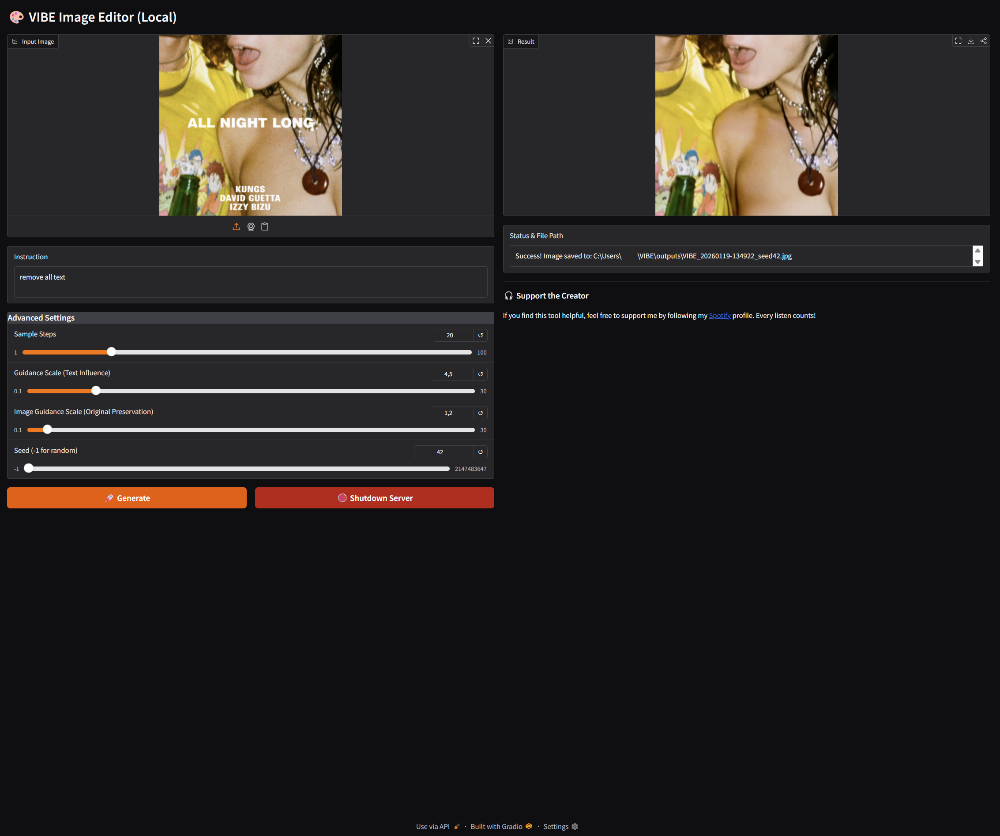
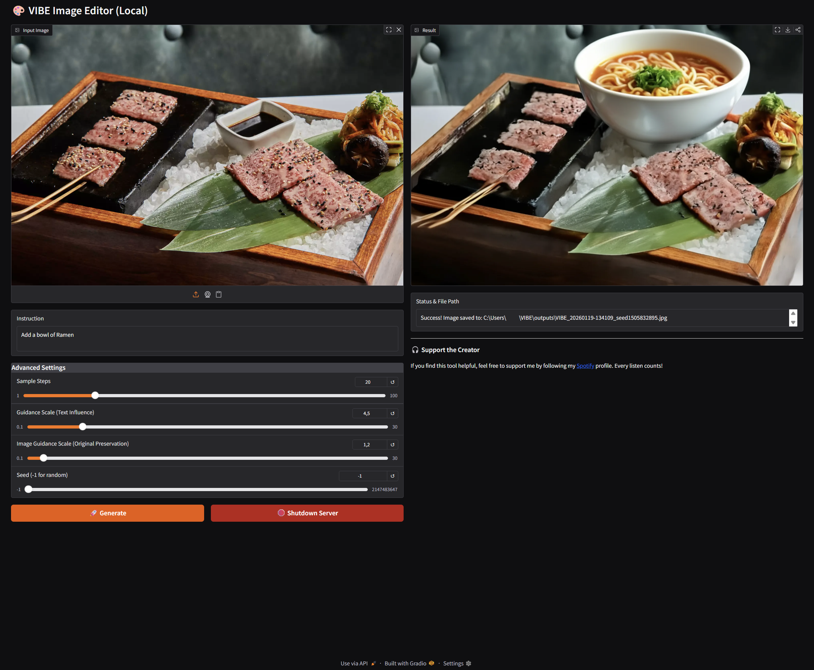
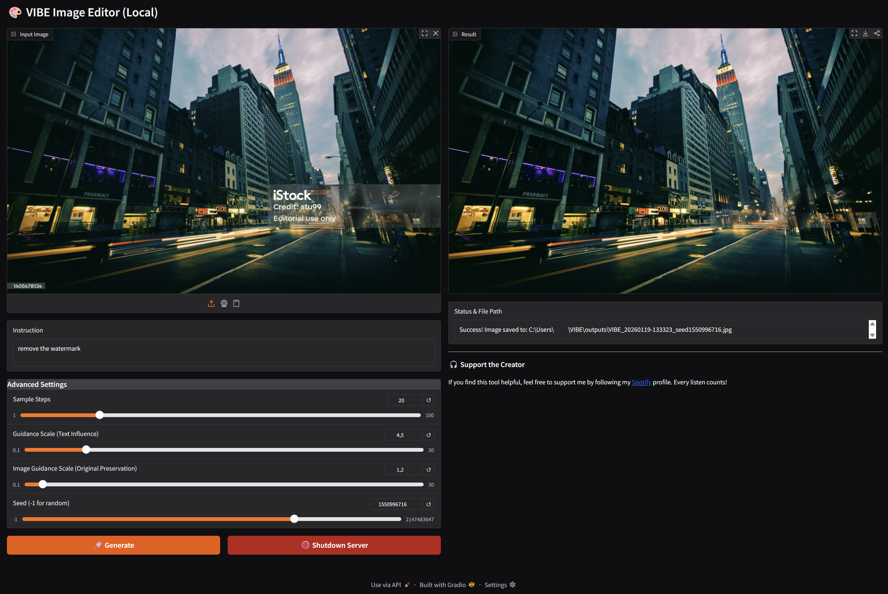
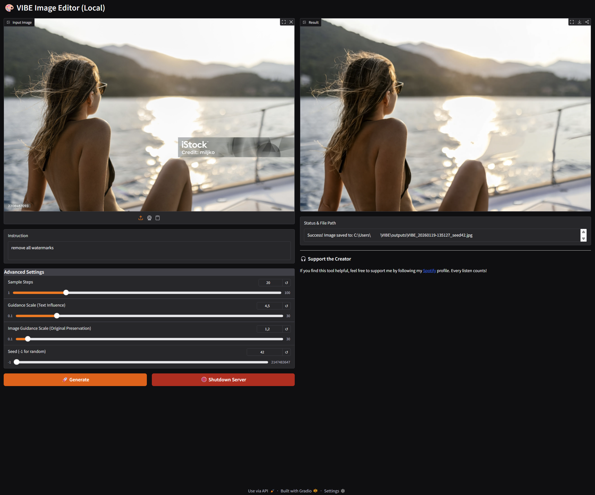

# VIBE Local GUI (Windows) 🎨

A high-performance local Web-UI for the VIBE model, now powered by the Sana1.5 (1.6B) diffusion backbone and Qwen3-VL (2B) vision encoder. This tool allows for exceptionally fast and high-quality instruction-based image editing directly on your machine.

Tested on Windows 11 with NVIDIA RTX GPUs (Optimized for Blackwell).



*(Run your own local instance with full privacy and speed)*

## 🖼️ Examples

<details>
<summary>👁️ Click here to see more examples</summary>

### Object Interaction


### Change Appearance


### Text Removal


### Object Interaction


### Watermark Removal


### Watermark Removal


</details>

## ✨ New in v2.0

* **Sana1.5 Engine**: Features linear attention for rapid generation and lower VRAM usage.
* **Qwen3-VL Intelligence**: Advanced multimodal understanding for complex editing instructions.
* **Real-Time Monitor**: Live tracking of CPU, RAM, and VRAM directly in the header.
* **High-Res Support**: Edit images up to 2048px with multi-scale support.
* **Auto-Save**: All results are saved to `/outputs` with full metadata in the filename.

## 🛠️ Installation

> [!IMPORTANT]
> **Migration from v1.x**: Due to significant changes in the model architecture and core dependencies (Torch 2.6.0), a clean install is required. Please delete your existing `venv` folder before proceeding.

### 1. Prerequisites

* Python 3.10+
* NVIDIA GPU (RTX 30-series or newer recommended)
* Git

### 2. Setup

Open a terminal (PowerShell) in the project directory:

```powershell
# 1. Create a virtual environment
python -m venv venv

# 2. Activate the environment
.\venv\Scripts\Activate.ps1

# 3. Install requirements (Optimized for CUDA 12.8 Nightly)
pip install -r requirements.txt
```

## 🚀 Usage

1. **Launch the App**: Double-click the provided `start.bat` or run:

```powershell
python app.py
```

2. **First Run**: The script will download the model weights (~10GB) from Hugging Face.
3. **Edit Images**: Upload an image, type an instruction (e.g., "Make it look like a rainy cyberpunk night"), and hit Generate.

## 🔧 Troubleshooting

### "AssertionError: Torch not compiled with CUDA enabled"

This is the most common issue on Windows. It happens when the CPU-only version of Torch is installed. To fix it, run this inside your activated `(venv)`:

```powershell
# Uninstall the wrong versions
pip uninstall torch torchvision torchaudio -y

# Force install the CUDA 12.8 Nightly build
pip install --pre torch torchvision torchaudio --index-url https://download.pytorch.org/whl/nightly/cu128
```

## 🎛️ Advanced Controls

| Setting | Description |
|---------|-------------|
| **Sample Steps** | Higher values improve quality but take longer (20-30 is sweet spot). |
| **Guidance Scale** | How strictly the AI follows your text instruction. |
| **Image Guidance** | Higher values keep the original image structure more intact. |
| **Seed** | Use a fixed number to reproduce specific results. |

## 🔗 Credits

* **VIBE Framework**: [ai-forever/VIBE](https://github.com/ai-forever/VIBE)
* **Model Weights**: iitolstykh on Hugging Face
* **Backbones**: Sana1.5 & Qwen3-VL-2B-Instruct

## 🤝 Support

This is a free open-source project. I don't ask for donations.
However, if you want to say "Thanks", check out my profile on **[Spotify](https://open.spotify.com/artist/7EdK2cuIo7xTAacutHs9gv?si=4AqQE6GcQpKJFeVk6gJ06g)**.
A follow or a listen is the best way to support me! 🎧
